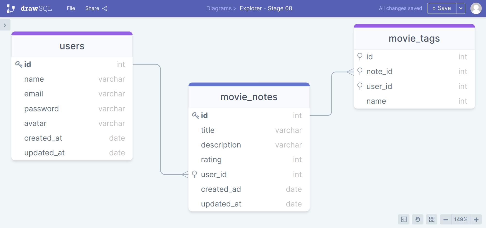

<h1 align="center"> API Backend </h1>

Projeto desenvolvido no stage 8 do curso Explorer da rocketseat.

  <a href="#-tecnologias">Tecnologias</a>&nbsp;&nbsp;&nbsp;|&nbsp;&nbsp;&nbsp;
  <a href="#-projeto">Projeto</a>&nbsp;&nbsp;&nbsp;|&nbsp;&nbsp;&nbsp;
  <a href="#-layout">Layout</a>&nbsp;&nbsp;&nbsp;|&nbsp;&nbsp;&nbsp;
  <a href="#memo-licença">Licença</a>

 

  

## 🚀 Tecnologias

Esse projeto foi desenvolvido com as seguintes tecnologias:

- NodeJs
- SqLite
- Git e Github

## 💉 Dependências

- Express 
- Express-async-errors 
- sqlite 
- bcryptjs 
- Knex 

## 💻 Projeto

A ideia do projeto era criar uma aplicação em Node.js onde o usuário cadastra um filme, preenche com algumas informações (nome, descrição, nota) e cria tags relacionadas a ele.